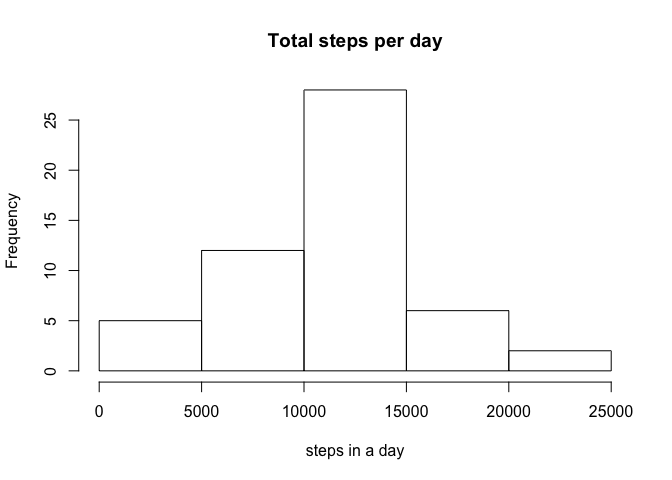
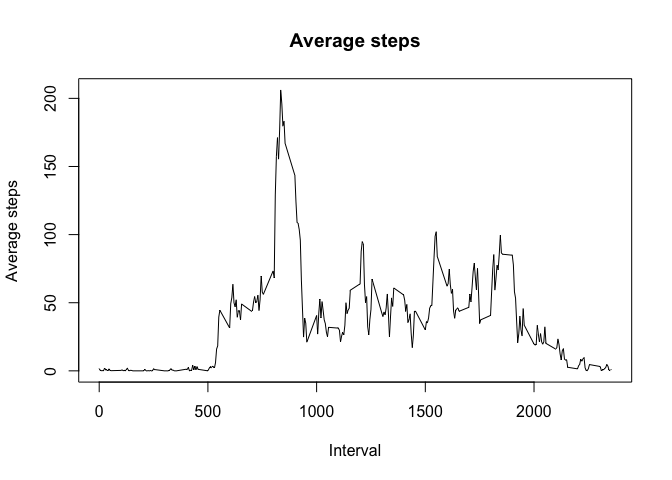
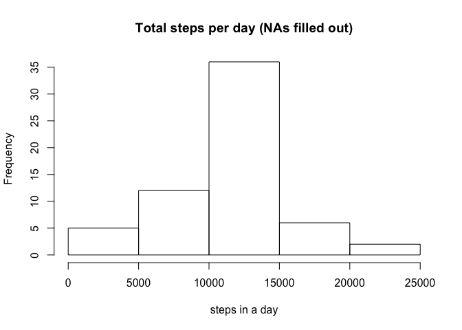
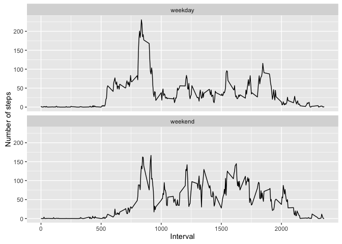

# Reproducible Research: Peer Assessment 1


## Loading and preprocessing the data

```r
library(knitr)
library(dplyr)
library(ggplot2)
```


```r
  rawData <- read.csv("sourceData/activity.csv", header = TRUE)
  cleanData <- subset(rawData, !(is.na(steps)))
  head(cleanData, 10)
```

```
##     steps       date interval
## 289     0 2012-10-02        0
## 290     0 2012-10-02        5
## 291     0 2012-10-02       10
## 292     0 2012-10-02       15
## 293     0 2012-10-02       20
## 294     0 2012-10-02       25
## 295     0 2012-10-02       30
## 296     0 2012-10-02       35
## 297     0 2012-10-02       40
## 298     0 2012-10-02       45
```


## What is mean total number of steps taken per day?

#### Q1 - Calculate the total number of steps taken per day


```r
  dailySteps <- group_by(cleanData, date)
  dailyStepsTotal <- summarise(dailySteps, totalSteps = sum(steps))
  dailyStepsTotal
```

```
## # A tibble: 53 × 2
##          date totalSteps
##        <fctr>      <int>
## 1  2012-10-02        126
## 2  2012-10-03      11352
## 3  2012-10-04      12116
## 4  2012-10-05      13294
## 5  2012-10-06      15420
## 6  2012-10-07      11015
## 7  2012-10-09      12811
## 8  2012-10-10       9900
## 9  2012-10-11      10304
## 10 2012-10-12      17382
## # ... with 43 more rows
```

#### Q2 - Make a histogram of the total number of steps taken each day


```r
  hist(dailyStepsTotal$totalSteps, main="Total steps per day", 
     xlab="steps in a day")
```

<!-- -->

#### Q3 - Calculate and report the mean and median of the total number of steps taken per day


```r
  meanDailySteps <- mean(dailyStepsTotal$totalSteps)
  medianDailySteps <- median(dailyStepsTotal$totalSteps)
```

the mean of the total number of steps taken per day = 10766

the median of the total number of steps taken per day = 10765


## What is the average daily activity pattern?

#### Q1 - Make a time series plot (i.e. 𝚝𝚢𝚙𝚎 = "𝚕") of the 5-minute interval (x-axis) and the average number of steps taken, averaged across all days (y-axis)


```r
  stepsInterval <- aggregate(steps ~ interval, cleanData, mean)


   plot(stepsInterval$interval, stepsInterval$steps, type='l', 
           main="Average steps", xlab="Interval", 
           ylab="Average steps")
```

<!-- -->

#### Q2 - Which 5-minute interval, on average across all the days in the dataset, contains the maximum number of steps?


```r
     maxStepsIndex <- which.max(stepsInterval$steps)
     maxStepsInterval <- stepsInterval[maxStepsIndex,"interval"]
     maxSteps <- stepsInterval[maxStepsIndex,"steps"]
```

The interval that has the maximum steps is 835 and the maximum avg. steps = 206


## Imputing missing values

#### Calculate and report the total number of missing values in the dataset (i.e. the total number of rows with 𝙽𝙰s)


```r
     sumNA <- sum(is.na(rawData)) 
```
The number of NA records = 2304

#### Devise a strategy for filling in all of the missing values in the dataset. The strategy does not need to be sophisticated. For example, you could use the mean/median for that day, or the mean for that 5-minute interval, etc.

I chose to try filling in NA's with the mean for that 5-minute interval

#### Create a new dataset that is equal to the original dataset but with the missing data filled in.


```r
  rawData_new <- rawData
  for (i in 1:nrow(rawData_new)) {
    if (is.na(rawData_new$steps[i])) {
      intervalValue <- rawData_new$interval[i]
      meanStepsValue <- stepsInterval[stepsInterval$interval == intervalValue,"steps"]
      rawData_new$steps[i] <- meanStepsValue
    }
  }
```

#### Make a histogram of the total number of steps taken each day and Calculate and report the mean and median total number of steps taken per day. Do these values differ from the estimates from the first part of the assignment? What is the impact of imputing missing data on the estimates of the total daily number of steps?


```r
  dailySteps_new <- group_by(rawData_new, date)
  dailyStepsTotal_new <- summarise(dailySteps_new, totalSteps = sum(steps))
  
  hist(dailyStepsTotal_new$totalSteps, main="Total steps per day (NAs filled out)", 
     xlab="steps in a day")
```

<!-- -->

```r
  meanDailySteps_new <- mean(dailyStepsTotal_new$totalSteps)
  medianDailySteps_new <- median(dailyStepsTotal_new$totalSteps)
  
  meanDiffNAs <- meanDailySteps_new - meanDailySteps
  medianDiffNAs <- medianDailySteps_new - medianDailySteps
```


after the NAs are filled, the mean of the total number of steps taken per day = 10766

after the NAs are filled, the median of the total number of steps taken per day = 10766

the difference between the means with and without NAs  = 0

the difference between the medians with and without NAs  = 1.1886792452824


## Are there differences in activity patterns between weekdays and weekends?

#### Create a new factor variable in the dataset with two levels – “weekday” and “weekend” indicating whether a given date is a weekday or weekend day.


```r
  dailySteps_new$weekday_weekend <- weekdays(as.Date(dailySteps_new$date))
  dailySteps_new$weekday_weekend[dailySteps_new$weekday_weekend %in% c('Saturday','Sunday')] <- 'weekend'
  dailySteps_new$weekday_weekend[dailySteps_new$weekday_weekend != 'weekend'] <- 'weekday'
  dailySteps_new$weekday_weekend <- as.factor(dailySteps_new$weekday_weekend)
```

#### Make a panel plot containing a time series plot (i.e. 𝚝𝚢𝚙𝚎 = "𝚕") of the 5-minute interval (x-axis) and the average number of steps taken, averaged across all weekday days or weekend days (y-axis). See the README file in the GitHub repository to see an example of what this plot should look like using simulated data.


```r
  stepsInterval_new <- aggregate(steps ~ interval + weekday_weekend, dailySteps_new, mean)

  qplot(interval, steps, 
      data = stepsInterval_new, 
      geom=c("line"),
      xlab = "Interval", 
      ylab = "Number of steps") +
      facet_wrap(~ weekday_weekend, ncol = 1)
```

<!-- -->

